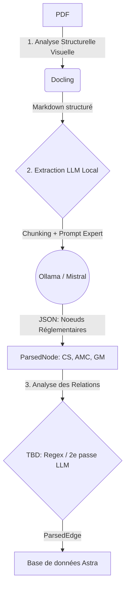

# Plan : Implémentation du Smart PDF Parser

## Architecture Globale

L'objectif est de remplacer ou d'augmenter les anciens parsers basés sur PyMuPDF (heuristiques rigides sur les polices) par une approche hybride en 3 étapes. Cette méthode permettra de traiter des documents PDF de formats hétérogènes (anciens CS, AMC-20, SC, TGL) avec une grande résilience.

---

## Étape 1 : Analyse Structurelle Visuelle avec Docling

Docling excelle dans l'OCR de nouvelle génération et la détection de la mise en page (Layout Analysis).

**Objectif :** Transformer le PDF brut en un flux continu de texte riche, débarrassé du "bruit" visuel.

**Actions prévues :**
*   **Nettoyage natif** : Docling est configuré pour ignorer les en-têtes et pieds de page (headers/footers) qui posaient problème aux anciens parsers.
*   **Préservation sémantique** : Les tableaux, les listes et les images/formules sont traduits proprement en Markdown.
*   **Sortie attendue** : Une chaîne de caractères contenant le document complet formaté en Markdown valide.

---

## Étape 2 : Structuration via LLM Local (Ollama / Mistral)

C'est le cœur de l'intelligence du parser. Mistral (via l'API OpenAI locale `http://localhost:11434/v1`) lira le Markdown et en extraira les données métier structurées.

**Objectif :** Identifier les "nœuds" réglementaires (articles CS, AMC, GM) et les ségréguer.

**Actions prévues :**
*   **Chunking Intelligent** : Le Markdown généré par Docling est trop volumineux pour la fenêtre de contexte d'un LLM local (Mistral a typiquement 8k à 32k tokens). Nous allons découper le texte en blocs logiques d'environ 10 000 caractères, en forçant les coupures sur des balises d'en-tête (e.g., `\n# ` ou `\n## `) pour ne pas tronquer un article en son milieu.
*   **Suivi de la Hiérarchie (NOUVEAU)** : Durant le chunking, nous devons tracer le chemin hiérarchique (Subpart > Section) en lisant les titres `#`, afin de renseigner le champ `hierarchy_path` de la base de données (ex: `CS-25 / Subpart B / Flight / General`).
*   **Prompting JSON Mode** : Nous appellerons Ollama avec `response_format={"type": "json_object"}`. Le prompt système demandera strictement une liste d'objets contenant :
    *   `node_type` : "CS", "AMC", "GM", ou "IR".
    *   `reference_code` : Le code formel (ex: "CS 25.1309").
    *   `title` : Le titre de l'article.
    *   `content` : Le texte intégral de l'article (au format HTML ou Markdown).
*   **Robustesse** : Gérer les erreurs de parsing JSON si le LLM hallucine la structure, et retenter ou ignorer le chunk gracieusement.
*   **Fix immédiat** : Ajouter les imports manquants (`hashlib`) dans le code actuel.

---

## Étape 3 : Extraction des Relations / Arêtes (TBD)

Les documents réglementaires EASA sont fortement interconnectés (ex: "As required by CS 25.1309, ...", ou "AMC1 to CS 25.1309"). Extraire ces liens est crucial pour le graphe de connaissances d'Astra.

**Objectif :** Générer les objets `ParsedEdge` (ex: `REFERS_TO`).

**Approche (À définir - "TBD") :**
*   *Option A (Regex Rapide)* : Une fois les nœuds extraits, appliquer des expressions régulières (Regex) éprouvées sur le champ `content` de chaque nœud pour détecter des motifs comme `(CS|AMC|GM)\s+[\w\.\-]+`. C'est rapide, déterministe, mais peut rater des formulations complexes ("the requirements of paragraph (b) of AMC 20-115").
*   *Option B (Seconde Passe LLM)* : Faire un deuxième appel au LLM spécifiquement pour chaque nœud extrait, en lui demandant "Liste tous les identifiants réglementaires cités dans ce texte". Plus lent, mais plus intelligent (comprend le contexte).
*   *Recommandation actuelle* : Commencer par l'Option A (Regex) pour la rapidité d'ingestion. La bascule vers le LLM pourra se faire si la qualité des arêtes est jugée insuffisante.

---

## Implémentation Concrète dans `pdf_smart_parser.py`

1.  **Refactorisation du fichier existant** :
    *   Corriger l'import de `hashlib`.
    *   Modifier `_chunk_markdown` pour qu'il maintienne un état de la hiérarchie courante (ex: `["Subpart B", "Section 1"]`) et le passe au LLM ou l'associe directement aux nœuds trouvés dans ce chunk.
2.  **Conversion HTML** : Utiliser la librairie Python `markdown` pour transformer le champ `content` (Markdown issu de Docling) en HTML structuré avant de l'enregistrer dans `ParsedNode.content_html`.
3.  **Ajout d'une étape de Regex pour les Edges** : Ajouter une fonction `_extract_edges(nodes)` exécutée à la fin du processus, scannant le texte de tous les nœuds pour générer la liste `ParseResult.edges`.
